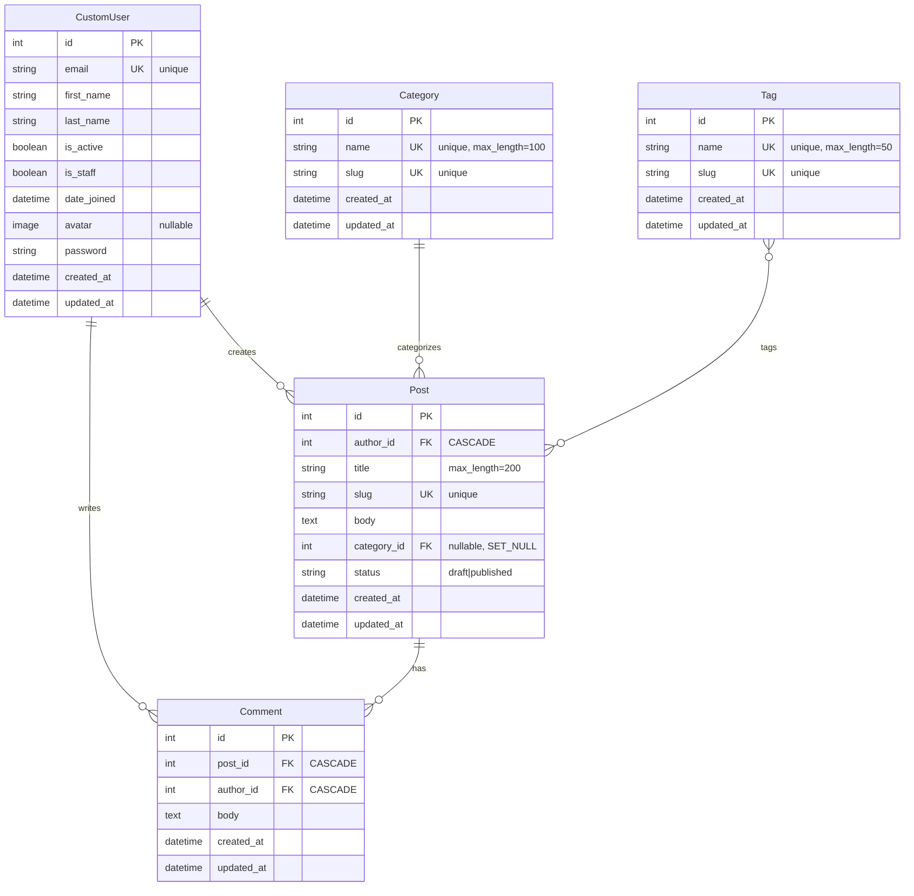

# Blog API - Entity Relationship Diagram

```mermaid
erDiagram
    CustomUser ||--o{ Post : "creates"
    CustomUser ||--o{ Comment : "writes"
    Category ||--o{ Post : "categorizes"
    Tag }o--o{ Post : "tags"
    Post ||--o{ Comment : "has"

    CustomUser {
        int id PK
        string email UK "unique"
        string first_name
        string last_name
        boolean is_active
        boolean is_staff
        datetime date_joined
        image avatar "nullable"
        string password
        datetime created_at
        datetime updated_at
    }

    Category {
        int id PK
        string name UK "unique, max_length=100"
        string slug UK "unique"
        datetime created_at
        datetime updated_at
    }

    Tag {
        int id PK
        string name UK "unique, max_length=50"
        string slug UK "unique"
        datetime created_at
        datetime updated_at
    }

    Post {
        int id PK
        int author_id FK "CASCADE"
        string title "max_length=200"
        string slug UK "unique"
        text body
        int category_id FK "nullable, SET_NULL"
        string status "draft|published"
        datetime created_at
        datetime updated_at
    }

    Comment {
        int id PK
        int post_id FK "CASCADE"
        int author_id FK "CASCADE"
        text body
        datetime created_at
        datetime updated_at
    }
```

